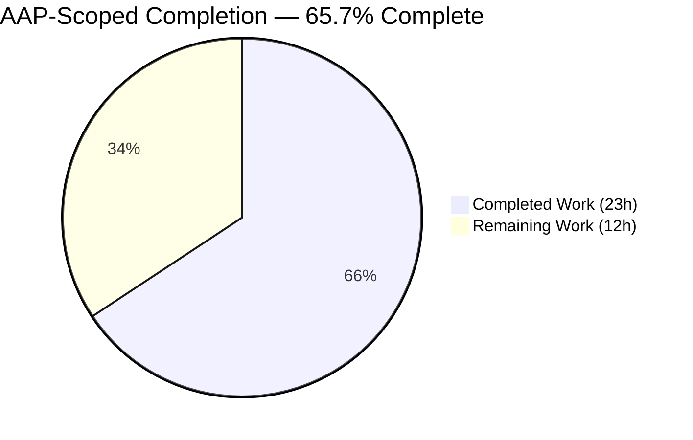
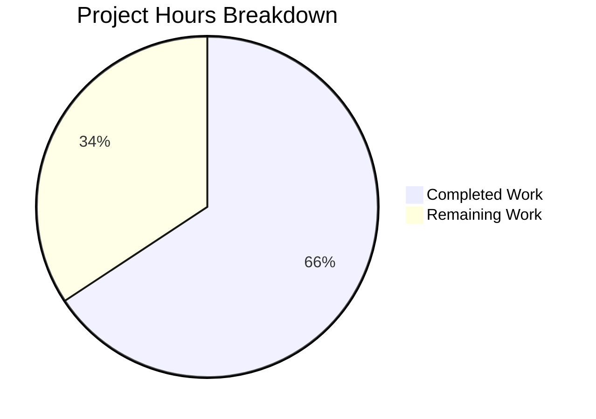
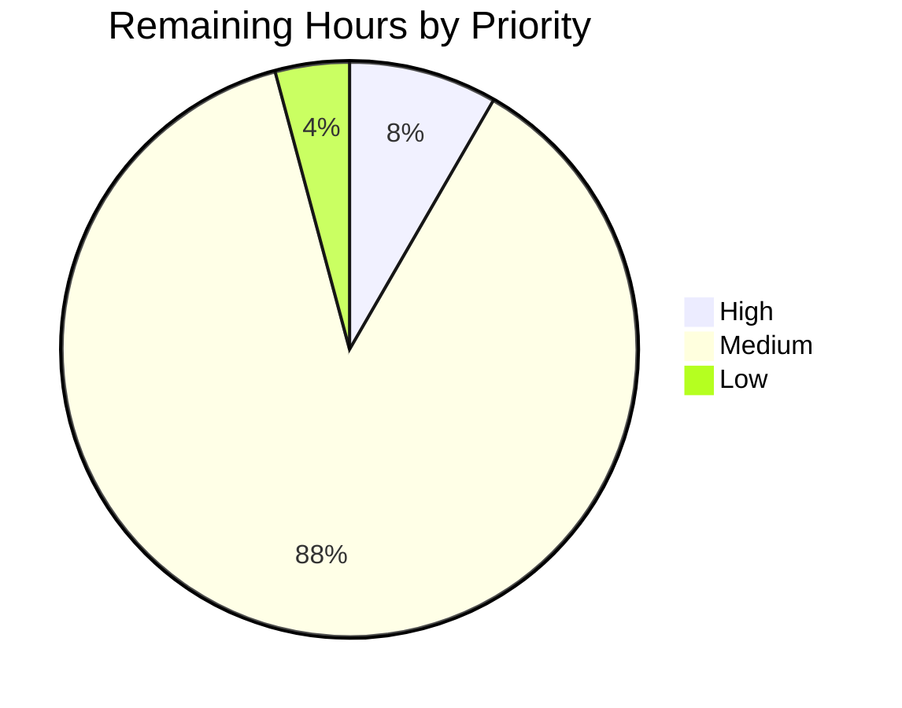
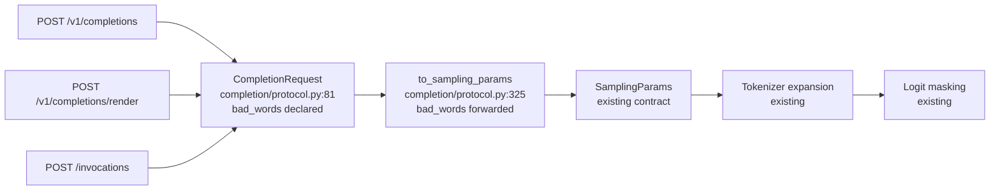

# 1. Executive Summary

## 1.1 Project Overview

The legacy Completions endpoint of this vLLM server accepted a `bad_words` parameter and then discarded it, so callers believed a generation constraint was active when none was applied. This project makes `bad_words` a typed, schema-published field of the Completions request model and forwards it into sampling-parameter construction, bringing the endpoint to parity with the Chat Completions endpoint that already honoured it. Every surface binding that model inherits it — `/v1/completions`, `/v1/completions/render` and the SageMaker `/invocations` route — reaching the existing tokenizer and logit-masking machinery unchanged. It serves API consumers who need word suppression and operators who need a truthful published contract.

## 1.2 Completion Status



*Chart colours — Completed: Dark Blue `#5B39F3`; Remaining: White `#FFFFFF`.*

| Metric | Value |
|--------|-------|
| **Total Hours** | **35.0** |
| Completed Hours (AI + Manual) | 23.0 (23.0 AI + 0.0 Manual) |
| Remaining Hours | 12.0 |
| **Percent Complete** | **65.7%** |

Calculation: `23.0 / (23.0 + 12.0) × 100 = 65.7%`.

## 1.3 Key Accomplishments

- ✅ `bad_words` is a declared, typed field of the Completions request model (`vllm/entrypoints/openai/completion/protocol.py:81`)
- ✅ The value is forwarded into sampling-parameter construction in the Chat-mirrored argument position (`:325`)
- ✅ A supplied list round-trips unchanged; an omitted parameter yields `[]` at both the request and sampling layers
- ✅ The parameter is published in the served OpenAPI document and in the generated endpoint parameter table
- ✅ Suppression verified end to end against a running server: non-streaming, streaming, echo and multi-candidate requests
- ✅ Inherited with no extra code by the render route and the SageMaker `/invocations` route
- ✅ An invalid type now returns HTTP 400 with a structured error naming the parameter instead of being silently ignored
- ✅ Four CPU-only request-contract tests pass in 1.5 s; the CPU-safe repository suite is green at 560 passed / 0 failed

## 1.4 Critical Unresolved Issues

| Issue | Impact | Owner | ETA |
|-------|--------|-------|-----|
| Invalid-type rejection has no automated assertion (see §5.2 DIV-1) | A future loosening of the `list[str]` annotation would restore silent tolerance without failing any test | Repository maintainer | 1.0 h |
| `use_beam_search=true` accepts `bad_words` and does not apply it (see §5.2 DIV-2) | Silent non-enforcement — the symptom this project removes — persists for beam-search callers on both generative endpoints | Repository maintainer | 2.0 h |
| No automated coverage of the parameter on the served HTTP routes | Route-level contract regressions would not be caught by continuous integration | Repository maintainer | 2.5 h |
| The accelerator-only portion of the entrypoints suite has not been exercised | Approximately 660 endpoint cases requiring GPU-class models remain unrun | Repository maintainer | 2.0 h |

## 1.5 Access Issues

| System/Resource | Type of Access | Issue Description | Resolution Status | Owner |
|-----------------|----------------|-------------------|-------------------|-------|
| Accelerator hardware | Compute | No GPU is available, so 33 CUDA-kernel, distributed and transfer-connector test modules cannot be collected and the GPU-class endpoint tests cannot run | Open — schedule on accelerator hardware | Repository maintainer |
| Gated model repositories (`meta-llama/Llama-Guard-3-1B`, `google/paligemma-3b-mix-224`, `facebook/chameleon-7b`, `fixie-ai/ultravox-v0_5-llama-3_2-1b`) | Model registry authorization | The available token is not authorized for these repositories, so four chat-template content-format cases cannot resolve their configuration | Open — request authorization or deselect | Repository maintainer |
| Large served models (`openai/gpt-oss-20b`) | Host memory | The model exceeds available host memory, so ten chat-serving cases cannot start their server | Open — run on a larger host | Repository maintainer |

## 1.6 Recommended Next Steps

1. **[High]** Add an invalid-type assertion so the typed contract cannot be loosened silently — 1.0 h
2. **[Medium]** Decide and disclose the beam-search interaction — 2.0 h
3. **[Medium]** Add HTTP-level coverage posting the parameter to `/v1/completions` — 2.5 h
4. **[Medium]** Run the entrypoints test step on accelerator hardware and triage — 2.0 h
5. **[Medium]** Submit with the project's purpose, test-plan and test-result sections and a signed-off commit, then smoke-verify on the deployment target — 4.0 h

# 2. Project Hours Breakdown

## 2.1 Completed Work Detail

| Component | Hours | Description |
|-----------|-------|-------------|
| Request-schema declaration | 2.0 | `bad_words: list[str] = Field(default_factory=list)` at `vllm/entrypoints/openai/completion/protocol.py:81`, placed as the final entry of the published sampling-parameter block (lines 64–82) so the generated documentation table picks it up |
| Sampling-parameter forwarding | 1.5 | `bad_words=self.bad_words` inside the `SamplingParams.from_optional(...)` call at `:325`, between `logit_bias` and `allowed_token_ids` — the same argument sequence the Chat model uses |
| Request-contract behaviour | 1.0 | Supplied list round-trips unchanged; omitted parameter resolves to `[]` at both the request layer and the sampling layer, never `None` |
| Request-contract test module | 3.5 | `tests/entrypoints/openai/test_completion_bad_words.py` — four CPU-only tests covering forwarding, the default, JSON binding with typed capture, and per-instance isolation of the default list |
| Integration-surface analysis and confirmation | 2.5 | Three binding routes, the generic translation boundary in `completion/serving.py:177-182`, the request-type union, a subclass survey confirming no inheritance ripple, and the generated-documentation path |
| Convention and quality conformance | 2.0 | Pinned linter and formatter, full pre-commit hook sweep including type checking and licence headers, test placement and naming, no added imports and no dependency changes |
| Repository regression sweep | 2.5 | CPU-safe suite plus the request-model and renderer suites executed to confirm nothing else in the tree changed behaviour |
| Live endpoint runtime verification | 4.0 | Served model on CPU; OpenAPI publication, enforced suppression across non-streaming, streaming, echo and multi-candidate requests, the SageMaker and render routes, the error path, and the tokenizer-to-logit-mask chain |
| Reproducible build and test environment | 4.0 | CPU toolchain, native kernel build, dependency surface installed from a pinned constraint set, and a verified command set for build, test, lint and serve |
| **Total** | **23.0** | |

## 2.2 Remaining Work Detail

| Category | Hours | Priority |
|----------|-------|----------|
| Automated coverage for invalid-type rejection | 1.0 | High |
| HTTP-level regression coverage on the served routes | 2.5 | Medium |
| Beam-search interaction decision and disclosure | 2.0 | Medium |
| Accelerator-hardware CI validation and triage | 2.0 | Medium |
| Pull-request submission and review cycle | 2.0 | Medium |
| Deployment smoke verification | 2.0 | Medium |
| Published parameter-table verification | 0.5 | Low |
| **Total** | **12.0** | |

## 2.3 Hours Reconciliation

| Check | Result |
|-------|--------|
| §2.1 completed total | 23.0 h |
| §2.2 remaining total | 12.0 h |
| §2.1 + §2.2 | 35.0 h — equals Total Hours in §1.2 |
| Remaining hours in §1.2, §2.2 and §7 | 12.0 h in all three |
| Completion percentage | 23.0 / 35.0 = 65.7%, used identically in §1.2, §7 and §8 |

Confidence: **high** for the delivered feature work and its verification, which rest on executed tests, lint gates and live requests; **medium** for the accelerator-hardware validation and the review cycle, whose duration depends on hardware availability and reviewer turnaround.

# 3. Test Results

Every figure below comes from a run executed against this branch. Counts are of executed test cases, not of test files.

| Area / Category | Framework | Tests | Passed | Failed | Coverage | What This Proves |
|-----------------|-----------|-------|--------|--------|----------|------------------|
| `bad_words` request contract (unit) | pytest 8.3.5 | 4 | 4 | 0 | Both changed production lines | A supplied list reaches the sampler unchanged, an omitted parameter yields `[]`, a JSON body binds it as a declared typed field with no leftover extras, and the default list is per-request |
| CPU-safe repository regression | pytest 8.3.5 | 600 | 560 | 0 | 40 skipped; 34,607 deselected as accelerator-bound | Nothing else in the engine, scheduler, configuration or protocol layers changed behaviour |
| Request-model validation (chat request validations, renderers) | pytest 8.3.5 | 97 | 93 | 4 | Cross-endpoint request validation and chat-template resolution | Request validation on neighbouring endpoints is unaffected; the four non-passing cases require gated model repositories this environment cannot authorize |
| Chat serving layer | pytest 8.3.5 | 25 | 25 | 0 | Serving-layer request handling | The sibling generative endpoint's serving path is unchanged; ten further cases need a model larger than available host memory and did not start |
| Live endpoint checks | curl against a served model | 14 | 14 | 0 | Publication, sampling path, streaming, echo, multi-candidate, render and invocation routes, error path, tokenizer and masking chain | The parameter is published, accepted and actually enforced end to end on a running server |
| Static quality gates | ruff 0.14.0, pre-commit 4.0.1 | 14 | 14 | 0 | Both touched files | Lint, format, type-check, licence-header and import-policy gates all pass on the delivered code; seven further hooks are not applicable to these file types |

Aggregate across these areas: **754 cases selected — 710 passed, 4 failed, 40 skipped.** The four failures are cases that need model repositories the environment is not authorized to read. Feature test wall time is 1.5 s; the CPU-safe suite completes in 11 m 44 s.

**Not Covered**

- **Invalid-type rejection.** No assertion exercises a non-list value. The behaviour is correct today, but nothing would fail if the annotation were later widened. Add the assertion before release.
- **The served HTTP routes.** No test posts the parameter to `/v1/completions`, `/v1/completions/render` or `/invocations`; the request-contract tests deliberately construct the model in process with no server.
- **Documentation placement.** No test asserts the field stays inside the published sampling-parameter block. A misplacement would pass every test while silently dropping the parameter from the rendered endpoint table — check placement whenever that class body is reordered.
- **End-to-end generation with the constraint applied.** No automated test proves suppression through the engine and sampler.
- **Beam-search requests.** No test combines the parameter with `use_beam_search=true`, and the constraint is not applied on that path.
- **Accelerator-only endpoint coverage.** Approximately 660 cases in `tests/entrypoints/openai` need GPU-class models and were not executed; 33 CUDA-kernel, distributed and transfer-connector modules elsewhere cannot be collected without an accelerator.

# 4. Runtime Validation & UI Verification

A CPU server was started with a small served model on `127.0.0.1:8000` with an API key configured, and each flow below was driven with real HTTP requests.

- ✅ **Operational — Server start-up.** Healthy on `/health` 25 s after launch, with the Completions routes registered.
- ✅ **Operational — Published contract.** `GET /openapi.json` carries `bad_words` on the Completions request schema as `{"items":{"type":"string"},"type":"array"}` and correctly omits it from the required list.
- ✅ **Operational — `POST /v1/completions` enforcement.** With temperature 0 and a fixed seed the unconstrained continuation was `" the capital of the French Republic."`; banning `" capital"` changed it to `" the most populous city in the world,"`. A two-word list behaved the same way.
- ✅ **Operational — Streaming, echo and multi-candidate variants.** The streamed deltas, the prompt-echo branch and a two-candidate request all returned continuations free of the banned word.
- ✅ **Operational — Inert default.** Omitting the parameter and sending an explicit empty list both reproduced the unconstrained continuation byte for byte, so existing callers are unaffected.
- ✅ **Operational — SageMaker `POST /invocations`.** Returned HTTP 200 and applied the constraint, inheriting the field with no code of its own.
- ✅ **Operational — `POST /v1/completions/render`.** Accepted the parameter and returned rendered prompt tokens; that route performs no sampling translation by design, so it gains schema and validation only.
- ✅ **Operational — Error path.** A non-list value returned HTTP 400 with a structured error naming `bad_words` and its location in the request body, and no ignored-field warning was emitted for a valid request.
- ✅ **Operational — Tokenizer and masking chain.** Against a real tokenizer the parameter expanded to token-id sequences both with and without a leading space, and the logits operator drove the completing token's logit to negative infinity while leaving unrelated logits untouched.
- ⚠ **Partial — Beam-search requests.** `use_beam_search=true` is routed to the beam-search parameters object, which carries no `bad_words` member, so the value is accepted and not applied. This matches the Chat endpoint exactly and is covered in §5.2.

Not exercised at runtime: authentication and authorization flows beyond presenting a valid API key; the accelerator-only serving paths; and load or soak behaviour with large bad-word lists. **UI verification is not applicable** — this project exposes no user interface, only a machine-readable HTTP API, so there is no screen, component or client asset to verify.

# 5. Compliance & Quality Review

## 5.1 Compliance Matrix

| # | Deliverable | Benchmark | Status | Progress |
|---|-------------|-----------|--------|----------|
| 1 | Typed schema declaration | Declared field, `list[str]` annotation, per-instance default | ✅ Pass | 100% |
| 2 | Sampling-parameter forwarding | Caller value reaches `SamplingParams` unchanged | ✅ Pass | 100% |
| 3 | Request contract | Supplied list round-trips; omitted yields `[]`, never `None` | ✅ Pass | 100% |
| 4 | Parity with the sibling generative endpoint | Identical declaration form and identical argument order | ✅ Pass | 100% |
| 5 | Published API contract | Field present in the served OpenAPI document and in the generated parameter block | ✅ Pass | 100% |
| 6 | Structured error behaviour | Invalid type yields a structured 400, not an unhandled exception or a silent drop | ⚠ Pass, unautomated | 90% |
| 7 | Beam-search request path | Constraint applied when beam search is requested | ⚠ Not applied by design | 0% |
| 8 | Minimal-footprint discipline | Two insertions, zero deletions, zero imports, zero dependency changes | ✅ Pass | 100% |
| 9 | Backward compatibility | Optional field with an inert default; existing callers see identical behaviour | ✅ Pass | 100% |
| 10 | Quality gates | Pinned linter and formatter, type check, licence header, test placement and naming | ✅ Pass | 100% |
| 11 | Repository regression safety | CPU-safe suite green with no failures | ✅ Pass | 100% |
| 12 | Documentation currency | Generated surfaces carry the parameter with no hand-authored edits | ⚠ Pass, unrendered | 90% |

## 5.2 AAP & Rule Divergences and Gaps

No user-specified rules were supplied for this project, so every divergence below is measured against the Agent Action Plan. Three were identified.

| ID | What the AAP/Rule Required | What Was Delivered Instead | Why It Diverged | Impact | Remediation |
|----|---------------------------|----------------------------|-----------------|--------|-------------|
| DIV-1 | Acceptance criterion: "Supplying a non-list value raises a Pydantic `ValidationError`" | The behaviour is present and correct, but no test asserts it (`tests/entrypoints/openai/test_completion_bad_words.py`) | The test module was specified as exactly four functions mapped to the three behavioural requirements plus the default-factory invariant; type rejection was framed as a check to perform, not as one of those functions | Low functional, moderate regression exposure | Add one assertion — 1.0 h (§2.2) |
| DIV-2 | Parameter parity between the two generative endpoints, ending silent non-enforcement on Completions — with the beam-search translation explicitly out of scope | The constraint flows only through the sampling path; beam-search requests accept the value and do not apply it | Sanctioned scope boundary: the engine-side beam-search parameters object was excluded and parity with the Chat endpoint was the stated standard | The original symptom persists for beam-search callers | Document the limitation or extend the params object — 2.0 h (§2.2) |
| DIV-3 | A 47-line test module with four functions covering the three specified assertions plus the isolation guard | A 49-line module with the same four functions, carrying additional assertions on field membership, annotation and typed capture | Two acceptance criteria the plan left to manual checking were folded into the existing functions instead | None — machine-checked coverage is broader than specified | None required |

**DIV-1 — Invalid-type rejection is verified but not automated.** The acceptance criteria include a non-list value raising a validation error, and that behaviour works: posting `"bad_words": "notalist"` to `/v1/completions` returns HTTP 400 with `{'type': 'list_type', 'loc': ('body', 'bad_words')}`, and constructing the model directly raises the same error. What is missing is an assertion. The four tests in `tests/entrypoints/openai/test_completion_bad_words.py` cover forwarding, the default, JSON binding and instance isolation; none exercises a wrong type. The exposure is narrow but real: widening the annotation to `list[str] | None` or `Any` later would restore the silent tolerance this project removed, and the suite would stay green. Add the assertion (1.0 h); it needs no fixture and no server.

**DIV-2 — Beam-search requests still see silent non-enforcement (Sanctioned).** The plan bounded the change to the request model and its sampling translation, and explicitly left `to_beam_search_params` (`vllm/entrypoints/openai/completion/protocol.py:200-220`) alone. `BeamSearchParams` (`vllm/sampling_params.py:621-634`) declares only beam width, token budget, EOS handling, temperature, length penalty and stop-string output — there is no `bad_words` member to populate. So when `use_beam_search=true`, `completion/serving.py:173-176` takes the beam-search branch and the value is accepted and dropped. The Chat endpoint behaves identically (`chat_completion/protocol.py:399-411`), so parity holds and this is a sanctioned boundary rather than a defect. It is nonetheless the one surviving case of the symptom the project removed: decide whether to state the limitation in the parameter's consumer-facing description or extend the beam-search path (2.0 h).

**DIV-3 — The test module is broader than specified.** The plan described a 47-line module with four named functions and a specific assertion each. The delivered module is 49 lines with those same four functions, but `test_bad_words_parsed_from_json_payload` additionally asserts that the field appears in the model's declared fields, that its annotation is exactly `list[str]` and that `model_extra` is empty, while `test_bad_words_default_is_not_shared_between_requests` additionally asserts the default factory is `list`. Two properties the plan expected a human to check by hand are machine-checked instead. The prescribed footprint is otherwise untouched: one new file, four functions, no marker, no fixture, no mock, still 1.5 s on CPU. No action is needed; the divergence is recorded because the specification named a line count.

# 6. Risk Assessment

Each entry is a condition that could still cause trouble in production or in a later change.

| Risk | Category | Severity | Probability | Mitigation | Status |
|------|----------|----------|-------------|------------|--------|
| Widening the `list[str]` annotation in a later change would restore silent tolerance of the parameter | Technical | Medium | Low | Add the invalid-type assertion so any loosening of the annotation fails a test (§2.2, 1.0 h) | Open |
| The field drifting outside the published sampling-parameter block would drop it from the rendered endpoint table with no test failure | Technical | Low | Low | The field sits at `completion/protocol.py:81` inside the marker pair at lines 64–82 that the endpoint documentation embeds; confirm placement in review and after any reordering of that class body | Open |
| Beam-search callers supply the parameter and receive unconstrained output | Technical | Medium | Medium | Document the limitation for API consumers or extend `BeamSearchParams` (`vllm/sampling_params.py:621-634`) and the beam-search translation (§2.2, 2.0 h) | Open |
| A bad word that cannot be represented in the model vocabulary fails the request at tokenization | Integration | Low | Medium | The engine already raises a structured error naming the parameter and listing the offending token ids (`vllm/sampling_params.py:541-549`); exercise with the tokenizers actually deployed | Monitored |
| Large bad-word lists add tokenizer work on the request path | Operational | Low | Low | Each word is tokenized twice, with and without a leading space, and the resolved ids are cached on the parameters object (`vllm/sampling_params.py:251`); benchmark with production-sized lists before exposing the parameter to untrusted callers | Monitored |
| The SageMaker invocation route reaches the parameter without an API-key check | Security | Medium | Low | Pre-existing platform behaviour, unchanged by this work: the authentication middleware skips any path not beginning with `/v1` (`vllm/entrypoints/openai/server_utils.py:32-42`), and `/invocations` is such a path. Front the route with a gateway authorizer or restrict it at the network layer | Open — platform decision |
| The accelerator-only portion of the endpoint suite has not been exercised, so a CI-only failure could surface late | Operational | Low | Medium | Run the entrypoints unit-test step on accelerator hardware; roughly 660 cases need GPU-class models (§2.2, 2.0 h) | Open |
| Consumers may treat the parameter as a content filter | Operational | Medium | Medium | Enforcement is prefix-aware token-sequence suppression — only the token that would complete a bad word is masked (`vllm/v1/sample/ops/bad_words.py:9-38`) — so it is not a safety guarantee. Keep server-side moderation in place and state the semantics in consumer-facing documentation | Open |

# 7. Visual Project Status

**Overall hours — 65.7% complete**



*Completed = Dark Blue `#5B39F3`; Remaining = White `#FFFFFF`.*

**Remaining work by priority (12.0 h total)**



**Remaining hours by category**

| Category | Hours | Share |
|----------|-------|-------|
| HTTP-level regression coverage on the served routes | 2.5 | 20.8% |
| Beam-search interaction decision and disclosure | 2.0 | 16.7% |
| Accelerator-hardware CI validation and triage | 2.0 | 16.7% |
| Pull-request submission and review cycle | 2.0 | 16.7% |
| Deployment smoke verification | 2.0 | 16.7% |
| Automated coverage for invalid-type rejection | 1.0 | 8.3% |
| Published parameter-table verification | 0.5 | 4.2% |
| **Total** | **12.0** | **100%** |

**Delivered change footprint**



Only the two nodes carrying line references were changed; every other stage was already in place and is consumed unchanged.

# 8. Summary & Recommendations

**What was delivered.** The Completions endpoint now treats `bad_words` as a real parameter. Two lines of production code carry it: a typed declaration at `vllm/entrypoints/openai/completion/protocol.py:81`, positioned as the final entry of the block that the endpoint documentation embeds, and a forwarding argument at `:325` in the position the Chat endpoint uses. A four-test module, `tests/entrypoints/openai/test_completion_bad_words.py`, pins the request contract. Nothing else in the repository changed: the diff against the source branch is two files, 51 insertions and zero deletions, with the sampling parameters module, the Chat protocol, the serving layer, the routers, the documentation and every dependency manifest untouched.

**What was verified.** The contract holds at every layer that matters. In process, a supplied list reaches the sampler unchanged, an omitted parameter resolves to an empty list rather than `None`, a JSON body binds the value as a declared field with no leftover extras, and two requests never share one default list. Against a running server, the parameter appears in the published OpenAPI document, and banning a word demonstrably changes a deterministic continuation — on plain requests, streamed requests, prompt-echo requests and multi-candidate requests alike — while an empty list reproduces the previous output byte for byte. The SageMaker invocation route inherits and enforces the field with no code of its own; an invalid type returns a structured HTTP 400 naming the parameter. The CPU-safe repository suite is green at 560 passed with no failures, and the pinned lint, format, type-check and licence-header gates all pass.

**What remains.** Twelve hours, and none of it is feature work. One hour closes the only gap in the acceptance criteria — invalid-type rejection is correct but unasserted, so the typed contract could be loosened later without a test noticing. Two hours settle the beam-search question: requests that ask for beam search accept the parameter and do not apply it, because the beam-search parameters object has no member to carry it, exactly as on the Chat endpoint. The rest is ordinary path-to-production work: route-level regression coverage, a run of the endpoint suite on accelerator hardware, the submission and review cycle, a deployment smoke check, and a look at the rendered parameter table.

**Critical path.** Add the invalid-type assertion, then decide the beam-search disclosure, then submit. Those three unblock everything else and total five hours. The accelerator-hardware run and the deployment smoke check can proceed in parallel once hardware and a target host are available; they are the two items whose duration depends on access rather than on effort. Success is measurable: the feature module green with five tests instead of four, the endpoint step green on accelerator hardware, and one constrained generation observed on the deployment target.

**Production readiness.** At **65.7% of the scoped work complete (23.0 of 35.0 hours)**, the feature itself is production-ready code: minimal, convention-conformant, backward-compatible on an optional field with an inert default, and proven to work against a live server. The gap between that and a release is verification breadth, not correctness — an unasserted acceptance criterion, no route-level test, and a class of request (beam search) where the parameter is accepted without effect. Ship it once the invalid-type assertion is in place and the beam-search behaviour is disclosed; treat the accelerator-hardware run as the gate for merge rather than for the code.

# 9. Development Guide

Every command below was executed in this environment unless explicitly noted. Run all of them from the repository root.

## 9.1 System Prerequisites

| Requirement | Verified version | Notes |
|-------------|------------------|-------|
| Operating system | Ubuntu 25.10 (Linux x86-64) | 4 vCPU, 3.8 GB RAM is sufficient for the request-contract tests and a small served model |
| Python | CPython 3.12.13 | `pyproject.toml:34` declares `>=3.10,<3.14`; 3.12 is what the project's continuous integration uses and what the test manifest is compiled for |
| Compiler toolchain | gcc/g++ 15.2.0, cmake, ninja 1.13.0, ccache 4.11.2 | Needed only to rebuild native kernels |
| System libraries | `libnuma-dev`, `numactl`, `pkg-config`, `libtcmalloc-minimal4`, `ffmpeg`, `libsm6`, `libxext6`, `libgl1` | Installed via apt |
| Package tooling | pip 26.2.1, uv 0.12.2, setuptools 77.0.3 | |
| Accelerator | None required | The request-contract tests and a small CPU-served model need no GPU |

No database, cache, message broker or other external service is required.

## 9.2 Environment Setup

```bash
cd /path/to/repository
source .venv/bin/activate

export VLLM_TARGET_DEVICE=cpu
export CMAKE_DISABLE_FIND_PACKAGE_CUDA=ON
export CI=true
export TOKENIZERS_PARALLELISM=false

python -V                                         # Python 3.12.13
python -c "import vllm; print(vllm.__version__)"  # 0.16.0rc1.dev133+gb2eab6b95
```

If you keep those exports in a shell snippet, source it **without a pipe**: `source env.sh | tail -3` runs the script in a subshell and discards every export, leaving the system Python active. See Appendix E for the full variable list.

## 9.3 Dependency Installation

The virtual environment holds 410 packages plus an editable install of this repository with native CPU kernels (`vllm/_C.abi3.so`, 36.6 MB). To rebuild after touching native sources:

```bash
VLLM_TARGET_DEVICE=cpu CMAKE_BUILD_TYPE=Release MAX_JOBS=4 \
  uv pip install -e . --no-build-isolation --constraint <cpu-constraints.txt>
```

Roughly 16 s incremental, about 13 minutes cold. Derive `<cpu-constraints.txt>` from the committed `requirements/test.txt` by replacing the three torch-family rows with their CPU builds and dropping the GPU-only rows. **Do not regenerate it with a fresh `uv pip compile`** — that drifts to pytest 9, pytest-asyncio 1.x and starlette 1.x, which this test surface does not support. No tracked manifest is modified by this workflow.

## 9.4 Running the Tests

```bash
# The feature's request-contract tests — CPU only, no server, no model
python -m pytest tests/entrypoints/openai/test_completion_bad_words.py -v --no-header
# => 4 passed in ~1.5 s

# The CPU-safe portion of the repository suite
python -m pytest tests -m cpu_test -q --timeout=600 --continue-on-collection-errors
# => 560 passed, 40 skipped, 33 collection errors (accelerator-only modules), ~11 m 44 s

# Neighbouring request-model suites
python -m pytest tests/renderers tests/tool_use/test_chat_completion_request_validations.py \
  -q --timeout=300
# => 93 passed, 4 failed (cases needing gated model repositories)
```

A single-command contract probe, useful when bisecting:

```bash
python -c "from vllm.entrypoints.openai.completion.protocol import CompletionRequest; \
r = CompletionRequest(model='m', prompt='hi', bad_words=['foo']); \
print(r.to_sampling_params(max_tokens=16, logits_processor_pattern=None).bad_words)"
# => ['foo']
```

## 9.5 Lint, Format and Hooks

```bash
ruff check --no-fix vllm/entrypoints/openai/completion/protocol.py \
  tests/entrypoints/openai/test_completion_bad_words.py          # All checks passed!
ruff format --diff vllm/entrypoints/openai/completion/protocol.py \
  tests/entrypoints/openai/test_completion_bad_words.py          # empty diff

pre-commit run --files vllm/entrypoints/openai/completion/protocol.py \
  tests/entrypoints/openai/test_completion_bad_words.py          # exit 0
```

The hook sweep runs 14 applicable hooks — lint, format, spelling, type check, licence headers, lazy-import and import-policy guards, configuration validation — and skips 7 that do not apply to these file types. **Do not run `pre-commit install`**: its commit-message hook shells out to git identity configuration.

## 9.6 Running the Application

```bash
export LD_PRELOAD="/usr/lib/x86_64-linux-gnu/libtcmalloc_minimal.so.4:$VIRTUAL_ENV/lib/libiomp5.so"

VLLM_CPU_KVCACHE_SPACE=1 VLLM_CPU_OMP_THREADS_BIND=nobind OMP_NUM_THREADS=3 \
  vllm serve facebook/opt-125m \
    --dtype float32 --max-model-len 256 --max-num-seqs 4 --enforce-eager \
    --host 127.0.0.1 --port 8000 --api-key "$VLLM_API_KEY"
```

Healthy in about 25 s. `--device cpu` no longer exists — device selection comes from `VLLM_TARGET_DEVICE` at build time. On a 3.8 GB host use `VLLM_CPU_KVCACHE_SPACE=1`; the default of 8 GB will not fit.

Verify start-up:

```bash
curl -s -o /dev/null -w "%{http_code}\n" \
  -H "Authorization: Bearer $VLLM_API_KEY" http://127.0.0.1:8000/health   # 200
```

## 9.7 Example Usage

Confirm the parameter is published:

```bash
curl -s -H "Authorization: Bearer $VLLM_API_KEY" http://127.0.0.1:8000/openapi.json \
  | python3 -c "import json,sys; \
print(json.load(sys.stdin)['components']['schemas']['CompletionRequest']['properties']['bad_words'])"
# => {'items': {'type': 'string'}, 'type': 'array', 'title': 'Bad Words'}
```

Unconstrained, then constrained, with identical sampling settings:

```bash
curl -s -H "Authorization: Bearer $VLLM_API_KEY" -H "Content-Type: application/json" \
  -d '{"model":"facebook/opt-125m","prompt":"The capital of France is",
       "max_tokens":8,"temperature":0,"seed":1}' \
  http://127.0.0.1:8000/v1/completions
# choices[0].text => " the capital of the French Republic.\n"

curl -s -H "Authorization: Bearer $VLLM_API_KEY" -H "Content-Type: application/json" \
  -d '{"model":"facebook/opt-125m","prompt":"The capital of France is",
       "max_tokens":8,"temperature":0,"seed":1,"bad_words":[" capital"]}' \
  http://127.0.0.1:8000/v1/completions
# choices[0].text => " the most populous city in the world,"
```

An invalid type returns a structured error:

```bash
curl -s -w "\nHTTP %{http_code}\n" -H "Authorization: Bearer $VLLM_API_KEY" \
  -H "Content-Type: application/json" \
  -d '{"model":"facebook/opt-125m","prompt":"hi","bad_words":"notalist"}' \
  http://127.0.0.1:8000/v1/completions
# HTTP 400, error message naming ('body', 'bad_words'): "Input should be a valid list"
```

Add `"stream":true` for the streaming path, `"n":2` for multiple candidates, or post the same body to `/invocations` for the SageMaker surface — all three were exercised and behave identically with respect to this parameter.

## 9.8 Troubleshooting

| Symptom | Cause | Resolution |
|---------|-------|------------|
| `ModuleNotFoundError: No module named 'torch'`, or `ruff: command not found` | The system Python is active | `source .venv/bin/activate` |
| Environment variables missing right after sourcing a setup snippet | The `source` command was piped, so it ran in a subshell | Run it unpiped |
| A conftest error before any test executes | The root test configuration imports a traceback-serialisation helper at collection time | Ensure `tblib` is installed (it is, at 3.1.0) |
| `AttributeError: GPT2TokenizerFast has no attribute max_token_id` | A raw Transformers tokenizer was passed to the sampling parameters' tokenizer step | Use `from vllm.tokenizers import get_tokenizer` |
| Collection errors citing `Torch not compiled with CUDA enabled`, `Unsupported platform`, or an unset `RANK` | Accelerator-only or distributed modules on a CPU host | Select with `-m cpu_test` and pass `--continue-on-collection-errors` |
| `OSError: You are trying to access a gated repo` | Chat-template resolution cases need authorized model repositories | Request authorization or deselect those cases |
| `RuntimeError: Server exited unexpectedly` in chat serving tests | The model exceeds available host memory | Run on a larger host |
| A chat-warmup traceback while serving `facebook/opt-125m` | That model ships no chat template | Expected for this model; the Completions routes are unaffected |
| Server fails to allocate KV cache on start-up | `VLLM_CPU_KVCACHE_SPACE` exceeds available memory | Lower it to `1` |

# 10. Appendices

## A. Command Reference

| Purpose | Command |
|---------|---------|
| Activate the environment | `source .venv/bin/activate` (then export the variables in Appendix E) |
| Feature tests | `python -m pytest tests/entrypoints/openai/test_completion_bad_words.py -v --no-header` |
| CPU-safe repository suite | `python -m pytest tests -m cpu_test -q --timeout=600 --continue-on-collection-errors` |
| Neighbouring request-model suites | `python -m pytest tests/renderers tests/tool_use/test_chat_completion_request_validations.py -q --timeout=300` |
| Collect without executing | `python -m pytest <path> --collect-only -q` |
| Lint | `ruff check --no-fix <files>` |
| Format check | `ruff format --diff <files>` |
| Full hook sweep | `pre-commit run --files <files>` |
| Rebuild native kernels | `VLLM_TARGET_DEVICE=cpu CMAKE_BUILD_TYPE=Release MAX_JOBS=4 uv pip install -e . --no-build-isolation --constraint <cpu-constraints.txt>` |
| Serve on CPU | `vllm serve facebook/opt-125m --dtype float32 --max-model-len 256 --max-num-seqs 4 --enforce-eager --host 127.0.0.1 --port 8000 --api-key "$VLLM_API_KEY"` |
| Health check | `curl -s -o /dev/null -w "%{http_code}\n" -H "Authorization: Bearer $VLLM_API_KEY" http://127.0.0.1:8000/health` |
| Change footprint | `git diff --stat 494244f97...HEAD` |

## B. Port Reference

| Port | Service | Endpoints exercised |
|------|---------|---------------------|
| 8000 | vLLM OpenAI-compatible HTTP API (uvicorn) | `/health`, `/openapi.json`, `/docs`, `/v1/completions`, `/v1/completions/render`, `/invocations` |

No other listener is involved; the project uses no database, cache or message broker.

## C. Key File Locations

| Path | Role |
|------|------|
| `vllm/entrypoints/openai/completion/protocol.py` | Completions request model — `bad_words` declared at line 81 inside the sampling-parameter block (64–82); forwarded at line 325 inside the `SamplingParams.from_optional(...)` call; beam-search translation at 200–220 |
| `tests/entrypoints/openai/test_completion_bad_words.py` | The four request-contract tests |
| `vllm/entrypoints/openai/completion/api_router.py` | Routes — `create_completion` at line 46, `render_completion` at line 85 |
| `vllm/entrypoints/openai/completion/serving.py` | Translation boundary at lines 177–182; beam-search branch at 173–176 |
| `vllm/entrypoints/openai/chat_completion/protocol.py` | Parity reference — declaration at line 207, forwarding at line 515 |
| `vllm/sampling_params.py` | Consumer contract — field 247, token cache 251, factory parameter 268, constructor hand-off 309, `None`→`[]` normalization 351–352, tokenizer expansion and its structured error 511–549, resolved-ids property 564, `BeamSearchParams` 621–634 |
| `vllm/entrypoints/openai/engine/protocol.py` | Permissive base model at line 28 and the extra-field warning validator at 33–55 |
| `vllm/v1/sample/ops/bad_words.py` | Logit-masking operator, lines 9–38 |
| `vllm/entrypoints/sagemaker/api_router.py` | Invocation dispatch registering the request model, lines 43–48 |
| `vllm/entrypoints/openai/server_utils.py` | Authentication middleware, lines 32–42 |
| `docs/serving/openai_compatible_server.md` | Endpoint reference embedding the sampling-parameter block at line 202 |
| `docs/api/README.md` | Inference-parameter reference, lines 43–48 |
| `pyproject.toml` | Python range at line 34; linter rule selection at 65–83 |

## D. Technology Versions

| Component | Version |
|-----------|---------|
| Python | 3.12.13 |
| vLLM (editable, CPU) | 0.16.0rc1.dev133+gb2eab6b95 |
| torch / torchaudio / torchvision | 2.10.0+cpu / 2.10.0+cpu / 0.25.0+cpu |
| pydantic | 2.12.0 |
| fastapi / starlette / uvicorn | 0.128.0 / 0.50.0 / 0.35.0 |
| transformers / tokenizers | 4.57.5 / 0.22.0 |
| numpy / xgrammar | 2.2.6 / 0.1.29 |
| pytest / pytest-asyncio / tblib / httpx | 8.3.5 / 0.24.0 / 3.1.0 / 0.27.2 |
| ruff / pre-commit / mypy | 0.14.0 / 4.0.1 / 1.11.1 |
| ninja / ccache / gcc / uv / git | 1.13.0 / 4.11.2 / 15.2.0 / 0.12.2 / 2.51.0 |

## E. Environment Variable Reference

| Variable | Value used | Purpose |
|----------|-----------|---------|
| `VLLM_TARGET_DEVICE` | `cpu` | Selects the CPU backend at build time |
| `CMAKE_DISABLE_FIND_PACKAGE_CUDA` | `ON` | Keeps the build from probing for CUDA |
| `VLLM_CPU_KVCACHE_SPACE` | `1` (GB) | KV-cache allocation; the default of 8 will not fit a 3.8 GB host |
| `VLLM_CPU_OMP_THREADS_BIND` | `nobind` | Avoids thread pinning on a shared host |
| `OMP_NUM_THREADS` | `3` | Bounds CPU thread usage |
| `LD_PRELOAD` | tcmalloc + libiomp5 | Recommended allocator and OpenMP runtime for CPU serving |
| `VLLM_API_KEY` | operator-supplied | Bearer token for `/v1/*` routes |
| `CI` | `true` | Keeps tooling non-interactive |
| `TOKENIZERS_PARALLELISM` | `false` | Suppresses tokenizer fork warnings |
| `HF_HUB_OFFLINE` | `1` (optional) | Forces use of the local model cache |
| `MAX_JOBS`, `CMAKE_BUILD_TYPE`, `CCACHE_DIR`, `CMAKE_CXX_COMPILER_LAUNCHER` | `4`, `Release`, cache dir, `ccache` | Native rebuild settings |

## F. Developer Tools Guide

- **ruff 0.14.0** is both linter and formatter. The rule selection in `pyproject.toml:65-83` is `E`, `F`, `UP`, `B`, `ISC`, `SIM`, `I`, `G`; no explicit line length is set, so the 88-column default applies. Use `--no-fix` when checking, so nothing is rewritten silently.
- **pre-commit 4.0.1** runs the full gate set against named files. Prefer `pre-commit run --files <paths>` over installing the hooks, because the commit-message hook inspects git identity configuration.
- **mypy 1.11.1** runs inside the hook sweep against the lowest supported Python version; it passes on both touched files.
- **pytest 8.3.5** with `pytest-asyncio 0.24.0`. The `cpu_test` marker selects the accelerator-free subset. Add `--continue-on-collection-errors` on a CPU host so GPU-only modules do not abort the run. The request-contract module carries no marker, matching the convention of its directory, so it always runs with the endpoint tests.
- **Documentation** regenerates from source. The endpoint parameter table is produced from the marker-delimited block in the request model, and the inference-parameter reference is rendered from the sampling parameters module's docstrings — neither should be hand-edited.

## G. Glossary

| Term | Meaning |
|------|---------|
| `bad_words` | A list of words the model must not generate. Enforcement is prefix-aware: only the token that would complete a listed word is suppressed, and only when the tokens already generated match that word's preceding tokens |
| Completions endpoint | The legacy OpenAI-compatible text endpoint, `POST /v1/completions` |
| Chat Completions endpoint | The message-based OpenAI-compatible endpoint, used here as the parity reference |
| Request model | The Pydantic class defining an endpoint's accepted parameters; declaring a field on it is what publishes the field in the served schema |
| Sampling parameters | The engine-side object carrying per-request generation settings, built from the request model at the translation boundary |
| Extra field | A body key with no declared field. The base request model permits these and logs them as ignored, which is how this parameter was previously accepted and then discarded |
| `default_factory` | The Pydantic mechanism giving each request instance its own empty list, instead of sharing one list across all requests |
| Beam search | An alternative decoding mode with its own parameters object, which carries no `bad_words` member |
| Render route | `POST /v1/completions/render`, which validates and tokenizes a request without generating, and performs no sampling translation |
| Invocation route | `POST /invocations`, the SageMaker compatibility surface that dispatches to the same handler as `/v1/completions` |
